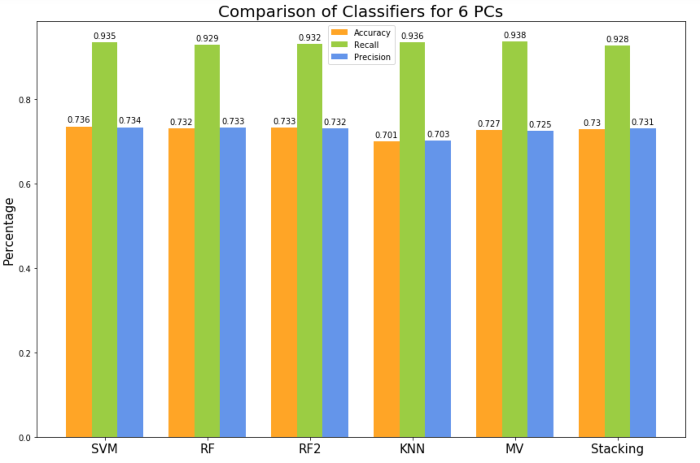
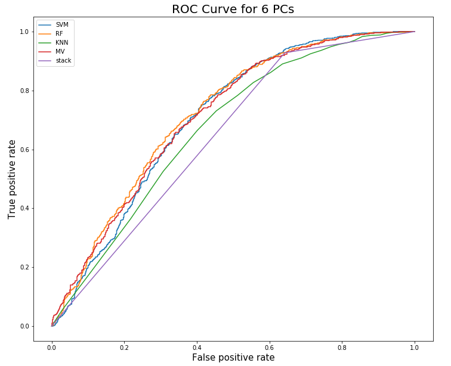
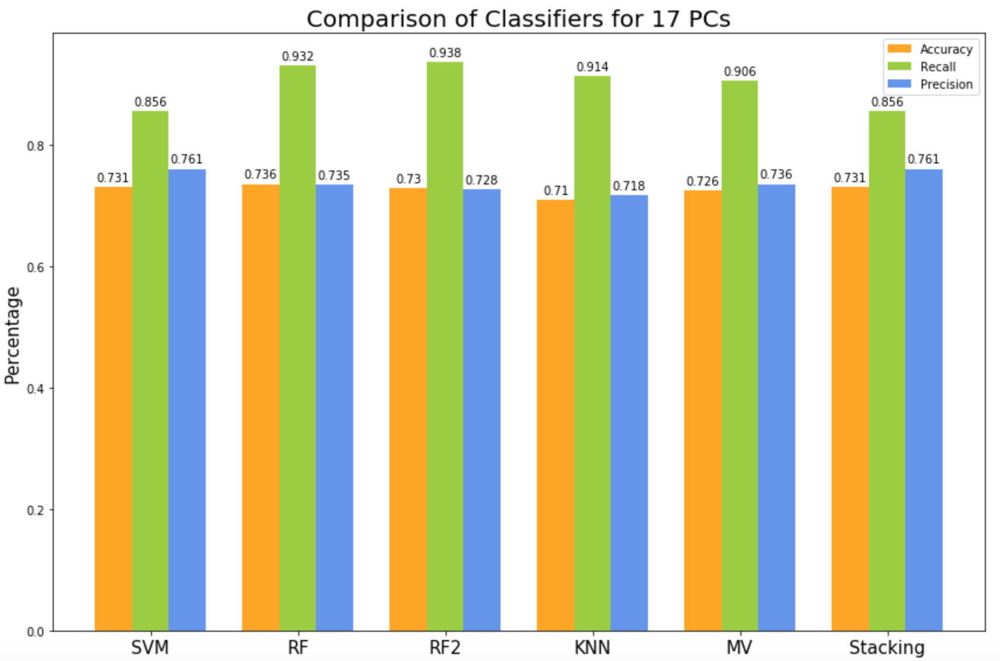
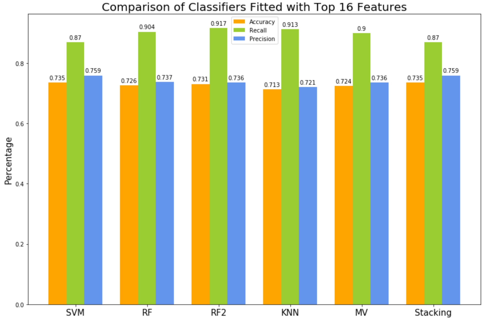
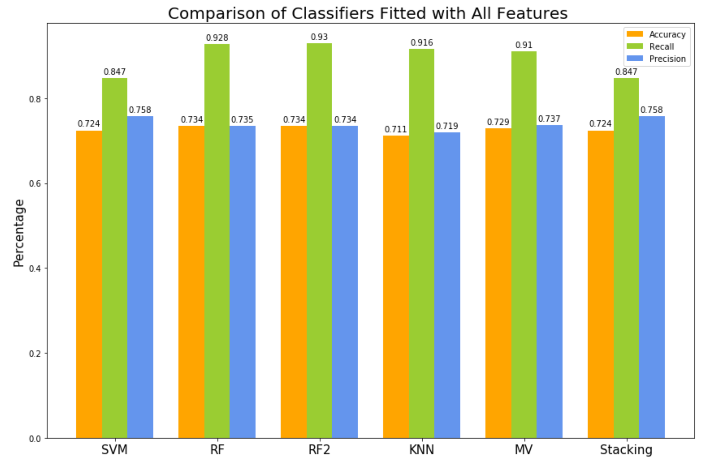

 
# **Classification of Acute Lymphoblastic Leukemia (ALL) in Blood Cell Images Using Machine Learning**
## Ji Ye (JC) Chun, Phillip Galonsky, Haoran Zhang

          
# Introduction
Acute lymphoblastic leukemia (ALL) is a type of cancer where the bone marrow produces too many immature lymphocytes. ALL is the most common cancer found in children, accounting for 30% of all pediatric cancer. While ALL has one of the highest cure rates in all of childhood cancers (88.5%), it progresses rapidly, so quick diagnosis is critical for timely treatment. Among various diagnosis methods for ALL, the microscopic analysis of blood cells is the most economical and has the advantage of being relatively non-invasive. However, microscopic analysis is time consuming and requires the supervision of a medical expert. Moreover, the results of such analysis are limited by their subjective nature and reliance on the expert’s skill. Over the last decade, various machine learning methods have been implemented for the diagnosis of ALL to overcome these shortcomings. 

# Dataset

  A dataset of cells with labels (normal versus cancer) is obtained from [University of Arkansas for Medical Sciences website]( https://app.box.com/s/xeclwwd2xep9ntljtgyptmt4k5wone9n). The dataset contains 15,114 microscopic images of cells from a total of 118 individual subjects, of which 69 have ALL and 49 are healthy. The images have been processed so that they contain only cells on a black background. The dataset is divided into a training set and a preliminary testing set for which the ground truth for each image has been marked by an expert oncologist.
  
  This  dataset  was  also  used  for  our  IEEE  ISBI  2019  conference  challenge: Classification  of Normal vs Malignant Cells in B-ALL White Blood Cancer Microscopic Images. The challenge is available here:
  
  [IEEE International Symposium on Biomedical Imaging](https://biomedicalimaging.org/2019/challenges/)
  
  [CodaLab](https://competitions.codalab.org/competitions/20429)

## Images of ALL and normal cells

 

# Feature Extractions
Visually, experience hematologists distinguish ALL from normal cells by comparing the morphological, chromatin pattern, and color characteristics or cells. In this project, quantitative morphological, texture, and color features are extracted from both ALL and normal cells in RGB, grayscale, and binary images (Table 1). 

 

 

Morphologically, ALL nucleus is characterized by large, irregular size and shape and its rough boundary. The size of nucleus is computed by counting the total number of pixels inf the nucleus in the binary images. The perimeter of the nucleus is calculated by counting the number of pixels representing the nucleus boundary. Form factor, roundness, length/diameter ratio, and compactness represent the shape of nucleus. Nucleus boundary roughness is measured by finding the variance, skewness, and kurtosis of all the distance between centroid and nucleus boundary points.

The chromatin distribution reflects the organization of RNA and DNA in nucleus, and it is an essential feature for recognizing ALL. The chromatin distribution is extracted as texture features using Haralick’s textural feature extraction method [1] and Haar wavelet. Haralick’s method uses the gray-level co-occurrence matrix (GLCM) to find statistical data which summarize the relative frequency distribution in s grayscale image. Haar wavelet texture features are obtained by applying a high pass and a low pass filter to the grayscale images and taking means and variance in the horizontal, vertical, and diagonal directions.

Color is another important descriptor of ALL nucleus. ALL nucleus has the sparse red-purple color whereas normal hemoglobin nucleus has the color of blue-purple. The means of red, green, and blue color are computed from the RGB images, and the means of hue, saturation, and value are also extracted from the HSV images. In addition to the colors, the intensity mean and variance are computed from the grayscale images.

In total, 9 Morphological, 21 texture, and 8 color features are extracted. After obtaining the numerical data, the features are scaled to lie in the interval [0,1] using min-max scaling.

 
|**Morphologial**                |**Texture**                                      |**Color**                      |  
|:------------------------------:|:-----------------------------------------------:|:-----------------------------:|
|Cell Size                       |Haralick Angular Second Moment                   |Red Mean                       |
|Perimeter                       |Haralick Contrast                                |Green Mean                     |
|Form Factor                     |Haralick Correlation                             |Blue Mean                      |
|Roundness                       |Haralick Variance                                |Hue Mean                       |
|Length/Diameter Ratio           |Haralick Inverse Difference Moment               |Saturation Mean                |
|Compactness                     |Haralick Sum Average                             |Value Mean                     |
|Boundary Roughness Variance     |Haralick Sum Variance                            |Intensity Mean                 |
|Boundary Roughness Skewness     |Haralick Sum Entropy                             |Intensity Variance             |
|Boundary Roughness Kurtosis     |Haralick Entropy                                 |                               |
|                                |Haralick Difference Variance                     |                               |
|                                |Haralick Difference Entropy                      |                               |
|                                |Haralick Information Measures of Correlation 1   |                               |
|                                |Haralick Information Measures of Correlation 2   |                               |
|                                |Haar Wavelet Approximation Mean                  |                               |
|                                |Haar Wavelet Horizontal Mean                     |                               |
|                                |Haar Wavelet Vertical Mean                       |                               |
|                                |Haar Wavelet Diagonal Mean                       |                               |
|                                |Haar Wavelet Approximation Variance              |                               |
|                                |Haar Wavelet Horizontal Variance                 |                               |
|                                |Haar Wavelet Vertical Variance                   |                               |
|                                |Wavelet Diagonal Variance                        |                               |

Table 1. **Features**

# Dimension Reduction
We applied two differenet dimension reduction methods: Random Forest (RF) and Principal Component Analysis (PCA).

|Ranking|Feature   |
|:-----:|:--------:|
|1|Cell Size|
|2|Perimeter|
|3|Haralick Difference Entropy|
|4|Haralick Contrast|
|5|Red Mean|
|6|Value Mean|
|7|Haralick Information Measures of Correlation 1|
|8|Haralick Information Measures of Correlation 2|
|9|Hue Mean|
|10|Saturation Mean|

Table 2. **Top 10 features from random forest**

 

 
 

  <b>Pairplot of Top 5 Features</b>

 <b>3D Scatter Plot of ALL vs. Normal with Top 3 Features</b>

 
 

As you can see, there is some slight separation of ALL and normal cells over the first few features, but there is not very much. To try to improve separability, we applied PCA to the data.

<b>Principal Component Analysis</b>

 

By the elbow test, we first elected to reduce our data to 6 principal components.

 <b>3D Scatter Plot of ALL vs. Normal with Top 3 Principal Components</b>

 
 

# Classification
The following figures reflect the training procceses done on the first 6 principal components. We applied 5 different classification models to the problem: Support Vector Machine (SVM), Random Forest (RF), K-Nearest Neighbor (KNN), Majority Voting (MV) and Stacking. The last two methods are enseble methods where we combined our SVM, RF and KNN models in hopes of further improving classification results.

### Support Vector Machine
For our SVM kernel, we used a the radial basis function (RBF) because it performed better than a linear kernel. To optomomize the hyperparamaters C and gamma we employed grid search cross validation.

### Random Forest
To optomize the hyperparameters of our Random Forest classifier, we again applied grid search cross validation, but this time with many more hyperparameters: number of estimators, bootstrapping (yes or no), maximum depth of estimators, the maximum number of features considered for each split, minimum samples required to split a node, minimum samples required to have on a leaf node. However, this model performed perfectly on our training data, indicating that it may have over-fitted to our train data. Thus, we created a second random forest classifier with more conservative hyperparameter inputs, e.g. smaller number of estimators and smaller maximum depth. We call this second classigier RF2.  

### K-Nearest Neighbor
For our KNN classifier, we used cross validation to optomize the hyperparameter K. The K value with the highest mean accuracy was 30.

### Ensemble Methods
We used two ensemble methods comprised of the SVM, RF and KNN methods that we had already tuned. First, we did a simple majority vote classifier to see if this improved results. Second, we employed a stacking method, wherein the SVM, RF and KNN classifiers served as base estimators, and we employed a Logistic Regression (LR) classifier as the meta classifier. 

# Results and Comparison of Methods

Each model performs about the same with around 73% accuracy. KNN performed the worst with 70.1% accuracy and SVM performed the best with 73.6%, as well as the best ROC curve. After viewing these results, we wondered if we were eliminating too much information by reducing to only 6 components, so we ran trained the models on 17 components. The results were essentially the same. Indeed, we got similar results when training on only the 16 most important features, and on no dimensionality reduction at all.

  
   

  
   

  
   

# Conclusion

This classification task was quite difficult, as the cancer cells and normal cells often appear quite similair, both as images and as extracted numerical features. All of our models, including the ensemble classifiers, performed similairly with accuracies arround 73% over different feature spaces. The best overall model is the Random Forest trained on data before any dimensionality reduction processes. While our models are not as accurate as we hoped, they are a good start for this classification problem, proving more accurate than a random guess. Moreover, while the accuracy of our models is relatively low, the percision is high. This means that a cell that is classified as cancerous has a high likelihood of being correctly identified. Lastly, while our false positive rates are quite high, our false negative rates are low. For the problem of identifying cancer, it is far better to have this situation than the opposite; we would rather incorrectly frighten some patients that do not have cancer with an incorrect diagnosis than erroneously tell patients who have ALL that they are cancer-free. 

# References
 
[1]	R. M. Haralick, K. Shanmugam, and I. Dinstein, "Textural Features for Image Classification," IEEE Transactions on Systems, Man, and Cybernetics, vol. SMC-3, pp. 610-621, Nov. 1973.
 
[2]	E. A. Mohammed, M. M. A. Mohamed, C. Naugler, and B. H. Far, "Toward leveraging big value from data: chronic lymphocytic leukemia cell classification," Network Modeling Analysis in Health Informatics and Bioinformatics, vol. 6, p. 6 (17 pp.), Feb. 18, 2017.
 
[3]	S. Mohapatra, D. Patra, and S. Satpathy, "An ensemble classifier system for early diagnosis of acute lymphoblastic leukemia in blood microscopic images," Neural Comp. & Applic., vol. 24, pp. 1887-1904, Jun. 1, 2014.
 
[4]	L. Putzu, G. Caocci, and C. Di Ruberto, "Leucocyte classification for leukaemia detection using image processing techniques," Artif. Intell. Med., vol. 62, pp. 179-191, Nov. 2014.
 
[5]	I. Vincent, K. Kwon, S. Lee, and K. Moon, "Acute lymphoid leukemia classification using two-step neural network classifier," in 21st Korea-Japan Joint Workshop on Frontiers of Computer Vision (FCV), 2015, pp. 1-4.
 
[6]	L. H. S. Vogado, R. M. S. Veras, F. H. D. Araujo, R. R. V. Silva, and K. R. T. Aires, "Leukemia diagnosis in blood slides using transfer learning in CNNs and SVM for classification," Eng. Appl. Artif. Intell., vol. 72, pp. 415-422, Jun. 2018.
 
[7] Howlader N, Noone AM, Krapcho M, Miller D, Brest A, Yu M, Ruhl J, Tatalovich Z, Mariotto A, Lewis DR, Chen HS, Feuer EJ, Cronin KA (eds). SEER Cancer Statistics Review, 1975-2016, National Cancer Institute. Bethesda, MD, https://seer.cancer.gov/csr/1975_2016/, based on November 2018 SEER data submission, posted to the SEER web site, April 2019.
 
